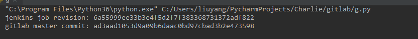

```
pip install python-gitlab
pip install jenkinsapi
```
修改 diff_jenkins_gitlab_commit.py 中的密码
```python
proj = Proj(username='admin', password='')
git = gitlab.Gitlab('https://gitlab.nxin.com', private_token='')
jen = Jenkins('http://jenkins.p.nxin.com', username='nx_admin', password='')
```

检查 jenkins 最新 build commit id 和 gitlab master 最新提交 commit id
```shell
python diff_jenkins_gitlab_commit.py project-name
```

结果



要求
- 项目必须在 proj 上填写过 repo, repo 必须是 gitlab
- 项目name 和 jenkins job name 要一致
- Charlie nx_project 目录下的 client.py